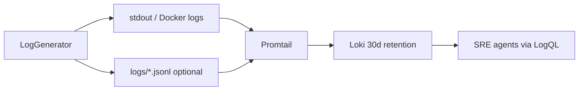

# sim.jsonl growth: how much data you actually need

## How logs flow today

| Layer                                                 | Role                                                                             | Grows forever?                                             |
| ----------------------------------------------------- | -------------------------------------------------------------------------------- | ---------------------------------------------------------- |
| `[logs/*.jsonl](fintech-sre-sim/config/promtail.yml)` | Optional file Promtail tails (`__path__: /var/log/sim/*.jsonl`)                  | **Yes**, if you use `--log-file` with no rotation          |
| Docker stdout                                         | Default path in `[Dockerfile](fintech-sre-sim/Dockerfile)` CMD (no `--log-file`) | Bounded by Docker log driver (unless configured otherwise) |
| [Loki](fintech-sre-sim/config/loki.yml)               | Canonical log store for Grafana + agents                                         | **No** — `retention_period: 720h` (30 days)                |

**Important:** Nothing in the repo reads `*.jsonl` directly for diagnosis. [projectflow_sre_agent.txt](projectflow_sre_agent.txt) specifies agents use a **Loki tool** (e.g. “last 20 error logs for affected service”), not the file.

Default `docker-compose` does **not** pass `--log-file`, so steady-state may never write `logs/*.jsonl` unless you add it. Growth becomes a problem when you run with `--log-file logs/sim.jsonl` (or similar) 24/7.

---

## How much log data is actually needed?

### At incident time (runtime)

| Consumer                   | Typical need                                         | Suggested query window                                                      |
| -------------------------- | ---------------------------------------------------- | --------------------------------------------------------------------------- |
| Detector                   | ~20 recent ERROR lines per affected service          | **5–15 minutes**                                                            |
| Diagnoser / runbooks       | Error patterns, security events, slow-query warnings | **15–30 minutes** (RB-001 deployment check: up to **30 min**)               |
| Compliance export (RB-005) | Audit window                                         | Explicit bounded range (hours–days), via Loki export—not full jsonl history |

Structured fields that matter for correlation (already parsed in [promtail.yml](fintech-sre-sim/config/promtail.yml)): `level`, `service`, `trace_id`, `span_id`, `scenario`, `injected`, `http_status`, `anomaly_type`, `timestamp`.

You do **not** need to retain the full jsonl on disk after Promtail has shipped lines to Loki.

### For DVC / evaluation (offline)

[projectflow_sre_agent.txt](projectflow_sre_agent.txt) Phase 8 plans a **finite** artifact: `data/simulation_runs/steady.jsonl` produced by a **bounded** `dvc repro` run—not an ever-growing production file.

---

## Why the file grows fast (if enabled)

From `[log_generator.py](fintech-sre-sim/generators/log_generator.py)`:

- Tick every **0.5s** (`tick_interval`)
- Per tick, per service: `rps_sample = max(1, int(base_rps * 0.005))` → roughly **12+ JSON lines/tick** across 6 services
- Rough rate: **~24 lines/sec** baseline (+ security/compliance/scenario extras)

Order-of-magnitude size (lines ~0.8–2 KB each):

| Duration | Approx. size                                      |
| -------- | ------------------------------------------------- |
| 1 hour   | ~70–170 MB                                        |
| 1 day    | ~1.7–4 GB                                         |
| 30 days  | **Not needed on disk** — Loki already caps at 30d |

`[main.py](fintech-sre-sim/generators/main.py)` only deletes the log file **on startup** (`os.remove`); it does not rotate during a long run.

---

## Recommended strategy (pick one primary path)

### Option A — Preferred for 24/7 sim: no local jsonl

- Keep generator on **stdout** (current Docker default).
- Rely on Promtail’s **docker-containers** job (already in [promtail.yml](fintech-sre-sim/config/promtail.yml) for `sim-generator`).
- Treat **Loki** as the only long-lived log store; tune `[loki.yml](fintech-sre-sim/config/loki.yml)` `retention_period` for dev (e.g. `72h` or `168h` instead of `720h`).

**Data you need:** whatever fits in Loki retention + agent query windows above.

### Option B — If you must write `logs/*.jsonl` for Promtail file tailing

Add **rotation or truncation** so the file never grows unbounded:

1. **Size-based rotation** in `LogGenerator` (e.g. `logging.handlers.RotatingFileHandler` or roll at 100–500 MB, keep 2–3 files).
2. **Time-based rotation** (new file hourly/daily; Promtail picks up `*.jsonl` glob).
3. **Post-ship cleanup**: after Promtail’s `positions.yaml` advances, delete or truncate shipped prefix (more fragile; rotation is simpler).

Promtail does **not** delete source files by default.

### Option C — DVC `steady.jsonl` only

- Run simulation with `--log-file` for a **fixed duration** (add `--duration-minutes` or stop after scenario completes).
- Store output under `data/simulation_runs/` (already gitignored via `data/` / `logs/` in projectflow).
- Version with DVC as a **snapshot**, not a live tail.

Typical snapshot sizes for reproducibility: **5–30 minutes** of steady state (~6–85 MB at baseline rates) is usually enough; full days are unnecessary.

---

## What to change in the codebase (when you implement)

1. **Document** in README / projectflow: jsonl on disk is optional; Loki is SoT; agents never read the file.
2. **Default compose**: explicitly avoid `--log-file` for `sim-generator`; use stdout → Promtail docker job.
3. **Optional flags** in `[main.py](fintech-sre-sim/generators/main.py)`:
  - `--log-file` + `--log-max-mb` / `--log-backup-count` (rotation), or
  - `--duration-minutes` for bounded DVC runs.
4. **Dev Loki retention**: lower `retention_period` in `[loki.yml](fintech-sre-sim/config/loki.yml)` if 30d is too heavy locally (separate from jsonl; Loki volume is `loki_data` Docker volume).
5. **Agent `loki_tool`**: enforce query limits (`limit=20`, `since=15m`) matching projectflow—prevents accidentally pulling huge result sets.

---

## Direct answer

| Question             | Answer                                                                                                                                                                           |
| -------------------- | -------------------------------------------------------------------------------------------------------------------------------------------------------------------------------- |
| How much from jsonl? | **Almost none after ingest** — only what Promtail has not yet shipped (seconds–minutes of lag).                                                                                  |
| How much for agents? | **~20–100 log lines** in the **last 5–30 minutes** per investigation; stored in **Loki**, not the file.                                                                          |
| How much for DVC?    | **One bounded run** (minutes, not months) → single `steady.jsonl` artifact.                                                                                                      |
| Can it keep growing? | **No** — either stop writing jsonl in steady mode (Option A) or rotate/truncate (Option B). Long-term history belongs in Loki with explicit retention, not an append-only jsonl. |

